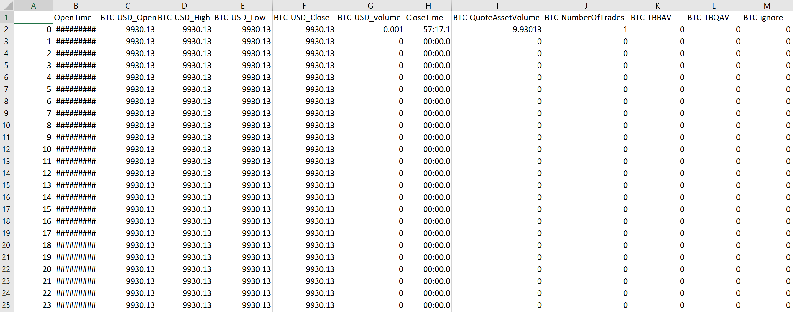
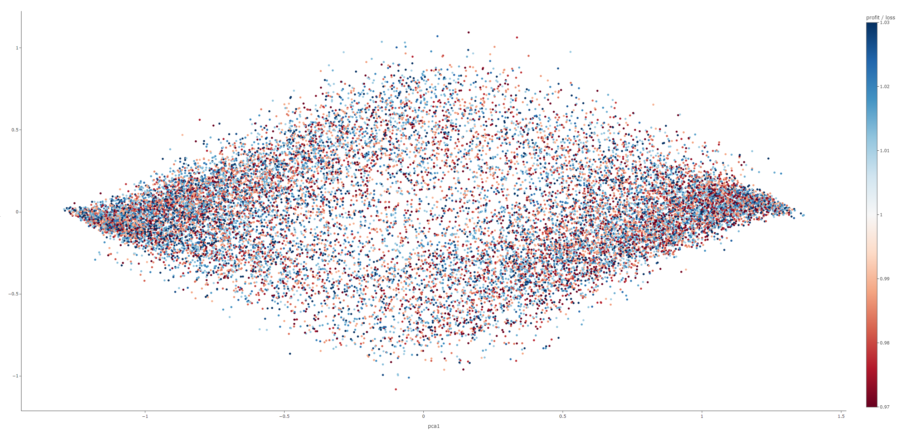
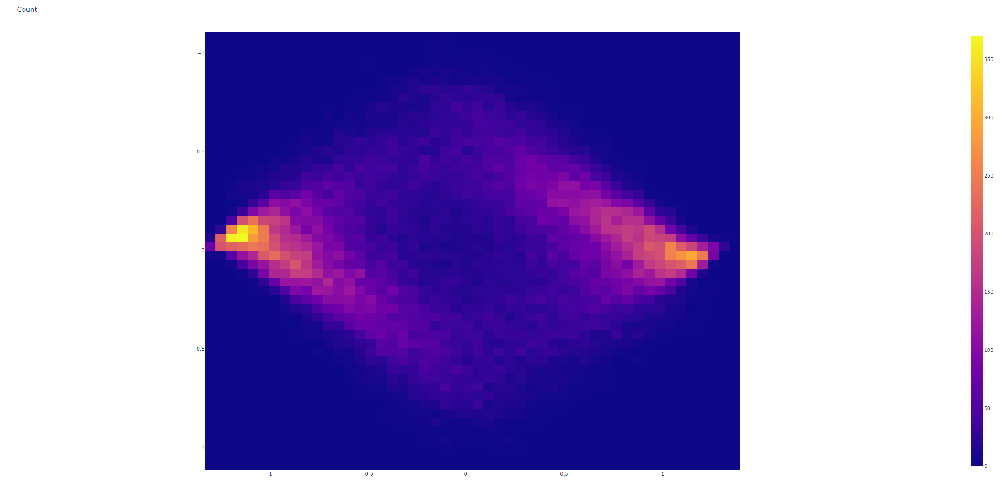
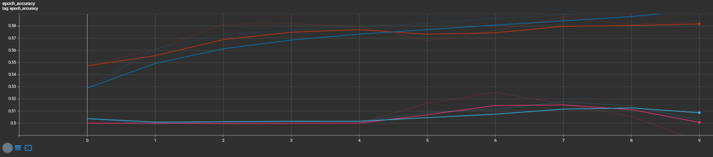

# CoinComplete: A Principle Component Analysis Machine Learning Tool Used for Cryptocurrency Investing.

# Abstract

My research determines if using machine learning to predict buy and sell orders through the Binance market is profitable.  Using a Principle component analysis (PCA) model to infer predictions on future market activity.  These predictions will be used to trade multiple currencies profitably.  For this research, I will just be looking at Bitcoin (BTC) and Ethereum (ETH) as they are the most frequently traded coins. Using the Binance API, data can be gathered from the present and the past.  Using this data in a Python script allows for manipulation of the data by applying it to the hyperparameters of the model.  The information that I am gathering will be able to predict when a person should buy and when a person should sell.  The research done here is done with careful consideration of previous other research.  Previous research has taken a look at various other methods that have proven not successful.  Most other research had also taken place during a bull market when this research differentiates itself by being done during a bear market. This research is intended to be used by cryptocurrency market analysts of any capacity.  It is something that is intended to help market traders more accurately know when to buy and sell.  This research was conducted to further the understanding of cryptocurrency market activity.  It attempts to answer questions about how to create profitable trading strategies in the crypto market.

# Run Instructions:

1. Clone the repository locally
```
git clone https://github.com/username/repo-name.git
cd repo-name
```

2. Install the required packages:
```
pip install tensorflow
pip install numpy
pip install python-binance
pip install binance
pip install pandas
pip install collections
pip install plotly
pip install scikit-learn
pip install ta
pip install warnings
pip install plot_utils
pip install time
pip install random
pip install keras
pip install os
```

Or simply run:
```
pip install -r requirements.txt
```

**RUNS BEST IN VISUAL STUDIO WITH ms-toolsai.jupyter**
**LOOK FOR ALL CAP COMMENTS FOR CHANGEABLE VARIABLES**

Run this program to load the data **NOTE: Date time frame variables are able to be changed inside file**:
```
python data_processor.py
```
Use: Shows heat map dislaying profit loss (A great way to find good target data)

Run with Jupyter Notebook **NOTE: Model able to be tweaked inside file**:
```
sentiment.ipynb
```
Use: Used to train model off of data collected. Also able to change model variables:
These values can be changed to optimize the trading performance of the algorithm:
```
SEQ_LEN = 60  # how long of a preceding sequence to collect for RNN
FUTURE_PERIOD_PREDICT = 3  # future prediction length
RATIO_TO_PREDICT = "BTC" # Coin being predicted
EPOCHS = 10  # passes
BATCH_SIZE = 64  # amount of in batch
NAME = f"{RATIO_TO_PREDICT}-{SEQ_LEN}-SEQ-{FUTURE_PERIOD_PREDICT}-PRED-{int(time.time())}"
```

To start trading with trained data run 
**NOTE: Target coin able to be changed inside file**:
**Example Input: BTC-60-SEQ-3-PRED-1679535879 (found in /models)**
```
trading.ipynb
```
Used: Used to conduct live market orders on the Binance.US exchange(amount traded is how confident the prediction is).

# Usage

The 'data' folder:

- The folder contains all of the csv market data that is retrieved from the Binance.US exchange

The 'models' and 'logs' folder:

- When training a model, this is where the logs and model will be stored

- To select the model to conduct live trading with, please copy the desired model's name when prompted for the 'trading.ipynb' file


**NOTE** this will NOT work unless you replace the key values in the keys.py with YOUR unique secret key and API key generated here https://www.binance.us/settings/api-management?tab=exchange (mine loaded for educational use only).

1. 
- Select the desired time of the data that is being retrieved, to do this change 'start_str' and 'end_str' and 'coins' in 'data_processor.py':
```
coins = ['BTC','ETH']
```
```
    start_str = 'Jan 1, 2016'
    end_str = 'Mar 20, 2023'
```
- If done successfully, the CSV files should look similar to this:


- Letting the Python script run for about 30 seconds will produce PCA graphs similar to these:





2. 
- To train the model, all a user must simply do is run the 'sentiment.ipynb' file
- This trains the model on all of the CSV files in the 'data' folder
- After training the model successfully, a user can access the validation metrics by running '%tensorboard --logdir logs/fit'
- Sample output below:



3. 
- To select the model to conduct live trading with, please copy the desired model's name when prompted for the 'trading.ipynb' file
**Example Input: BTC-60-SEQ-3-PRED-1679535879 (found in /models)**
- To select the desired coin for live trading, please change the two 'symbol' variables to the desired tokens name (example: BTC)
- You are now live trading!
**It is important to note that some coins have minimum trading amounts when conducting a trade through the API**
- Please reference this to verify that your trade meets the minimum requirements: https://www.binance.com/en/trade-rule
- To conduct unlimited backtesting please change the responding code to 'client = Client(api_key, secret_key, testnet=True)'


# Conclusions

The results of this tool should not be taken as real financial recommendations. This is only meant to see if the previous market trends can indicate future market results. While the average result that we get from this is just above random, messing with the data the model is trained on could prove to be an interesting experiment. However, it can be used to create better than random predictions. To see the experimentation results of this tool and further research please go [here](https://github.com/ReadyResearchers/cmpsc-600-fall-2022-and-spring-2023-senior-thesis-connellyw.git).
